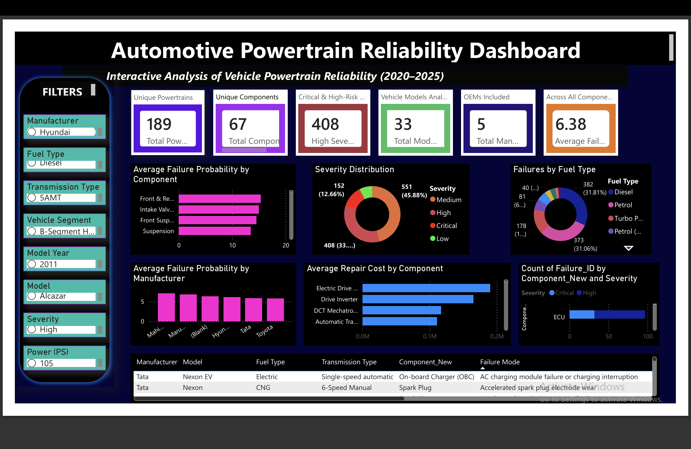
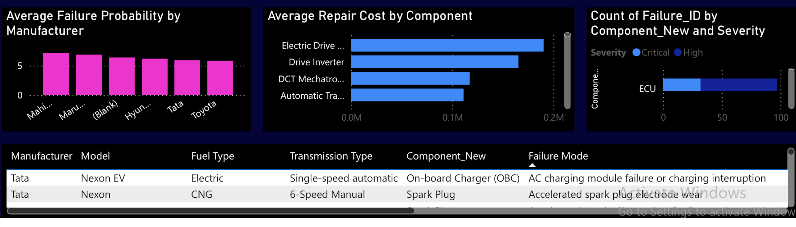
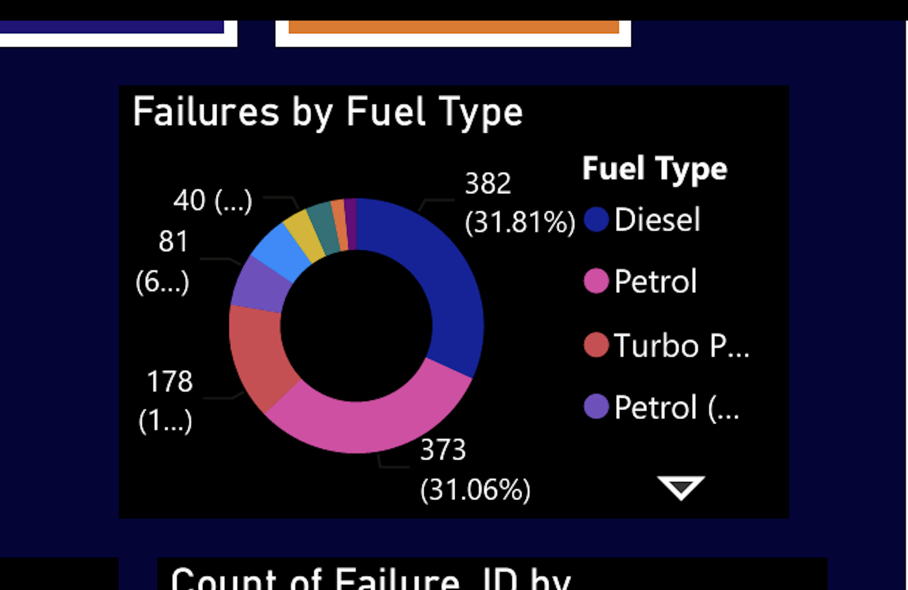
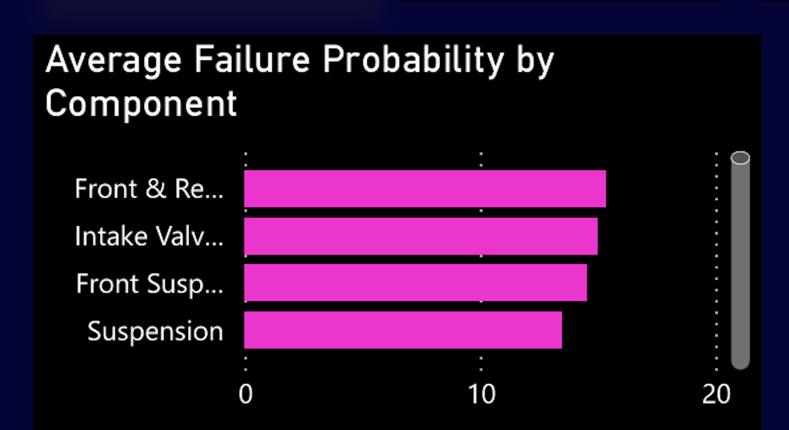

# 🚗 Automotive Powertrain Reliability Analysis

Python • PostgreSQL • SQL • Power BI • Pandas • DAX

## 📊 Executive Dashboard

## 🏭 Manufacturer Analysis

## ⛽ Fuel Type Analysis

## ⚠️ Failure Analysis

## 🏗️ Data Architecture & Methodology

## Overview

This project analyzes powertrain reliability across multiple vehicle manufacturers using Python, PostgreSQL, SQL, and Power BI.

## Objectives

- Identify high-risk components
- Analyze failure probabilities
- Compare repair costs
- Visualize severity trends

## Dataset

Vehicle Master
Powertrain Failure Profile

1202 Failure Records

189 Powertrain Configurations

## Tools

Python

Pandas

PostgreSQL

SQL

Power BI

Excel

## Dashboard

(image)

## Database Design

(image)

## SQL Analysis

(image)

## Key Insights

- Battery failures contribute...
- Cooling system...
- Transmission...
- High severity...

## Future Improvements

Predictive maintenance model

Machine Learning

Live dashboard
